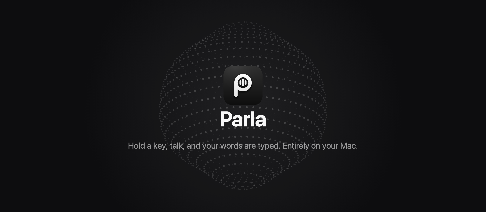
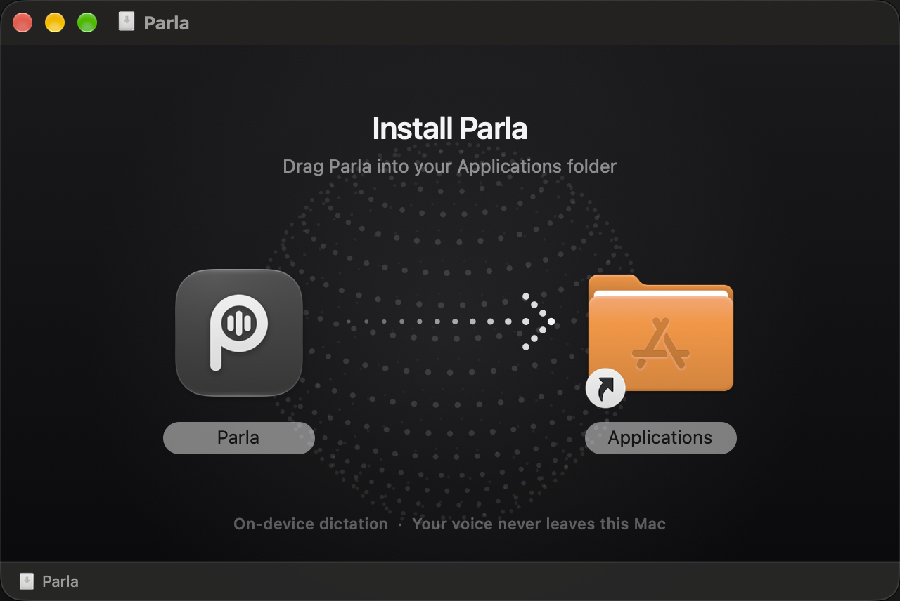

<p align="center">
  
</p>

<p align="center">
  <b>Fast, private dictation for macOS.</b><br>
  Hold a key, say what you want to write, let go. It's typed into whatever app you're using.
</p>

<p align="center">
  <a href="../../releases/latest"></a>
</p>

<p align="center">
  
  
  
  
</p>

---

## Why Parla

Most dictation apps send your voice to a server. Parla doesn't. Speech recognition runs on your Mac's Neural Engine, and text cleanup runs on Apple Intelligence on the same machine. No account and no subscription, and it works on a plane.

- **Private.** Your audio and your text stay on your Mac.
- **Fast.** Most dictations are typed about a second after you let go. Parla shows the time for every one.
- **Everywhere.** Works in any app that takes text: Slack, Mail, Notion, VS Code, your browser.
- **Multilingual.** Speak any of 25 European languages. Parla detects which one, so there's nothing to switch.

## Features

| | |
|---|---|
| **Hold to talk** | Hold the dictation key, speak, release. The text is typed where your cursor is. |
| **Hands-free** | Double-tap the key to keep recording without holding it. Stops when you tap again or go quiet. |
| **Enhance** | Removes "um", "uh" and false starts, and keeps only your final version when you correct yourself. Runs on-device with Apple Intelligence. |
| **Command Mode** | Select text, hold a second key and say "make this shorter" or "turn this into a list". The selection is rewritten in place. |
| **Match the app** | Casual in chat, polished in email, untouched in code editors. Parla only looks at which app is in front, never what's on screen. |
| **Your words** | Teach Parla the names, jargon and product spellings it gets wrong. |
| **Snippets** | Say "my email" and your address is typed. |
| **Live preview** | Watch your words appear as you speak (optional). |
| **History** | Search everything you've dictated and export it to Markdown. It's stored only on your Mac. |
| **Quiet mode** | Mutes music and video while you speak, then puts the volume back exactly as it was. |
| **Any microphone** | Pick the input device, or let it follow the system default. |

## Install

1. Download the latest `.dmg` from [**Releases**](../../releases/latest).
2. Open it and drag **Parla** into **Applications**.

<p align="center">
  
</p>

3. Open Parla. The setup guide asks for two permissions:
   - **Microphone**, to hear you.
   - **Accessibility**, to type into other apps. Without it, dictations are copied to the clipboard instead.

On first launch Parla downloads its speech models (about 720 MB) from Hugging Face. After that it works fully offline. The app is signed and notarized by Apple.

### Requirements

- A Mac with Apple Silicon (M1 or later)
- macOS 15 Sequoia or later
- For Enhance and Command Mode: macOS 26 with Apple Intelligence turned on. Without them, Parla still types punctuated text.

## Using Parla

| Action | How |
|---|---|
| Dictate | Hold **Option** (the default), talk, release |
| Hands-free | Double-tap the dictation key; tap again to stop |
| Cancel | Press any other key while holding the dictation key |
| Rewrite a selection | Select text, hold the Command Mode key, say what to change |
| Paste the last dictation again | Press the repeat key, if you set one |

You can change any shortcut in **Settings**, including combinations like Control + Option.

## How it works

```
 hold key ──► microphone ──► Parakeet TDT v3 ──► Apple Intelligence ──► typed into your app
                              (Neural Engine)      (optional cleanup)
```

- **Speech recognition:** [NVIDIA Parakeet TDT v3](https://huggingface.co/nvidia/parakeet-tdt-0.6b-v3), running as a Core ML model on the Neural Engine. It punctuates, capitalizes and recognizes 25 languages on its own.
- **Cleanup:** Apple's on-device [Foundation Models](https://developer.apple.com/documentation/foundationmodels) framework. The cleanup is skipped when there's nothing to fix, which saves about half a second.
- **Speed:** while you pause, Parla transcribes what you've said so far, so it's often finished by the time you let go.

## Build from source

You need Xcode 26, Rust, Node.js and pnpm.

```bash
pnpm install
pnpm app:dev          # run in development
pnpm tauri build      # build Parla.app
```

To build a signed, notarized DMG, store notarization credentials once and then run the release script:

```bash
xcrun notarytool store-credentials parla-notary --apple-id <apple-id> --team-id <team-id>
./scripts/release.sh
```

### Project layout

```
src/                 React UI: main window and the recording overlay
src-tauri/src/       Rust: hotkeys, paste, settings, history, snippets
src-tauri/swift-lib/ Swift: audio capture, Parakeet, Apple Intelligence
design/              Scripts that draw the icon, installer window and this banner
scripts/release.sh   Build, sign, notarize and staple the DMG
```

Run the tests with `cargo test --lib` in `src-tauri/`.

## License

Parla is **source-available, not open source.** You're welcome to read the code and to use Parla for personal, non-commercial purposes. You may not copy it, modify it, redistribute it or use it commercially. See [LICENSE.md](LICENSE.md) (PolyForm Strict 1.0.0). For any other use, [get in touch](https://github.com/BryanParreira).

Third-party code and licenses are listed in [THIRD_PARTY_NOTICES.md](THIRD_PARTY_NOTICES.md).

## Credits

- [Tauri](https://tauri.app): app framework
- [speech-swift](https://github.com/soniqo/speech-swift): Parakeet on Core ML
- [NVIDIA Parakeet](https://huggingface.co/nvidia/parakeet-tdt-0.6b-v3): speech recognition model
- [thinking-orbs](https://github.com/Jakubantalik/thinking-orbs) by Jakub Antalik (MIT): inspiration for the dotted recording orb

---

<p align="center">
  Made by <a href="https://github.com/BryanParreira">Bryan Parreira</a>
</p>
